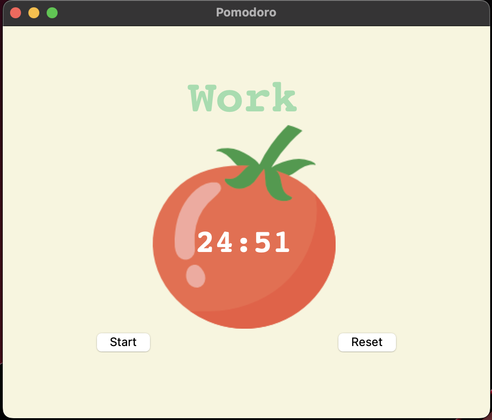

# pomodoro-app ⏰

A Pomodoro application that runs in the background.

- Start a 25 minute timer.
- Let it run in the background.
- Once the timer is finished, the application will jump to the front the screen and begin the 5 minute break timer.
- Track how many iterations you have completed.

## What is the Pomodoro Technique?

- Decide on a task to be done.
- Start a 25 minute timer.
- Work on the task until the timer rings.
- Take a 5 minute break.
- Repeat.

## Screenshot

